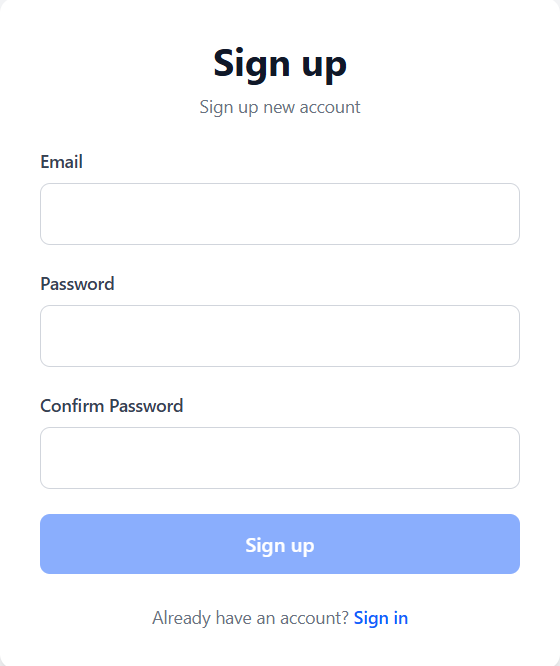
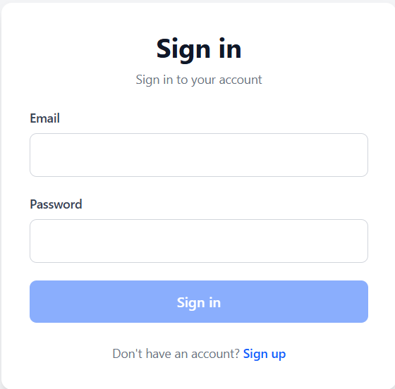
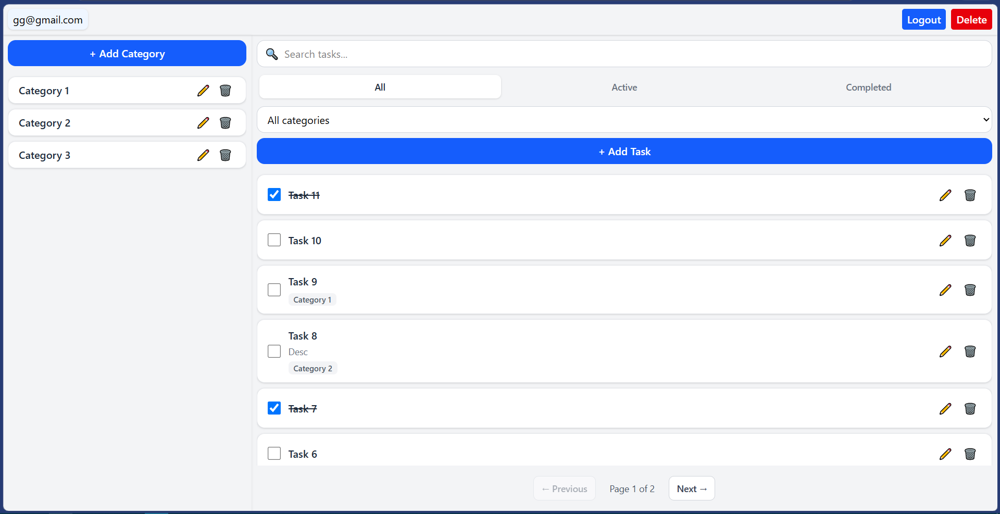
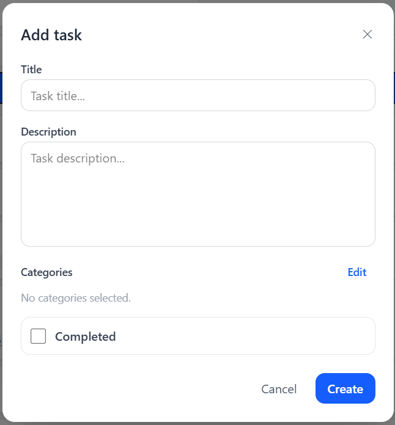
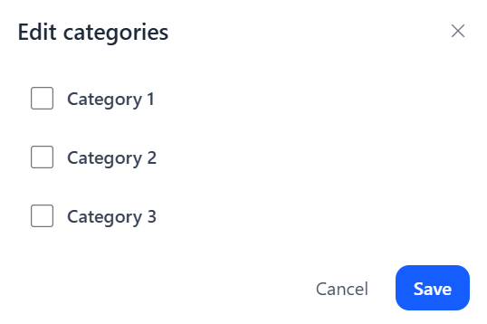

# ABOUT

Simple "ToDo" application, which allows user to create task lists and categories.
Backend side build on "ASP.NET Core". Frontend side build on "Angular" with "Tailwind CSS" for styles.
Solution have ".NET Aspire" to run and deploy everything.
Solution also have unit and integration tests.

Auth based on "Microsoft.AspNetCore.Identity" with JWT-token based authentication.
Solution supports long sessions due to refresh tokens.
Task list allows searching, filtering by categories and status.
Task list also have pagination.

'UI' project started by me, ended with AI. Other projects done fully by me.

# REQUIREMENTS

1. .NET 10 or higher installed
2. Node.js installed
3. Docker/Podman installed and running (check with "aspire doctor" command if "Aspire.Cli" installed)

# RUNNING

1. Right click on "ToDoApp.Web"
2. Select "Manage User Secrets"
3. Replace with text lower, providing your values
```json
{
  "Jwt": {
    "Issuer": "ToDoApp",
    "Audience": "ToDoApp.UI",
    "Key": "Paste generated JWT secret token (https://jwtsecrets.com/#google_vignette)",
    "ExpireMinutes": 15
  },
  "RefreshToken": {
    "ExpireDays": 3
  }
}
```
4. Right click on "ToDoApp.AppHost"
5. Select "Set as Startup Project"
6. Run the solution
7. Wait untill all running
8. Click on a link of the 'UI' project

# SCREENSHOTS

1. Register Form  


2. Login Form  


3. Main Page  


4. Task Form  


5. Categories Form  
